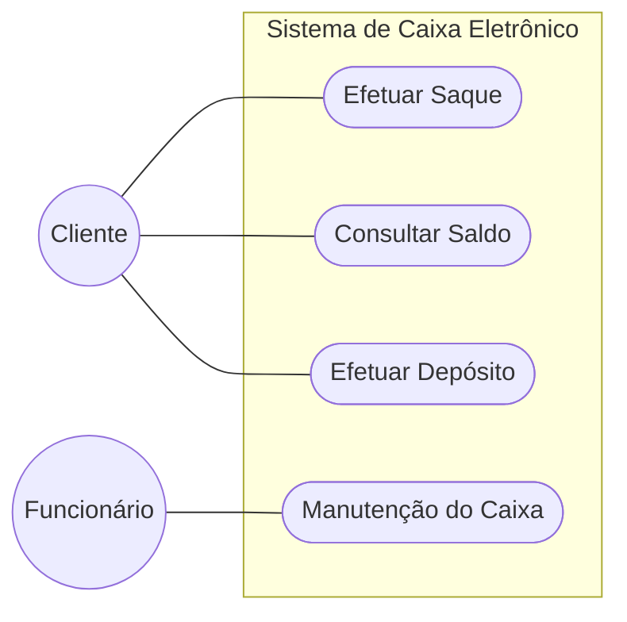
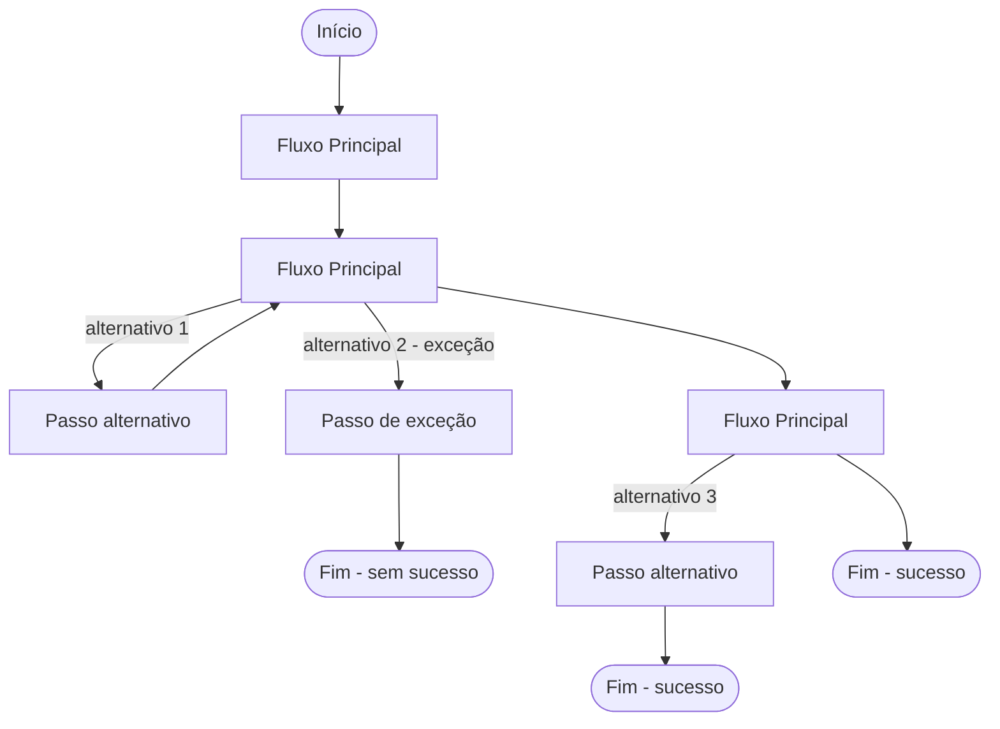
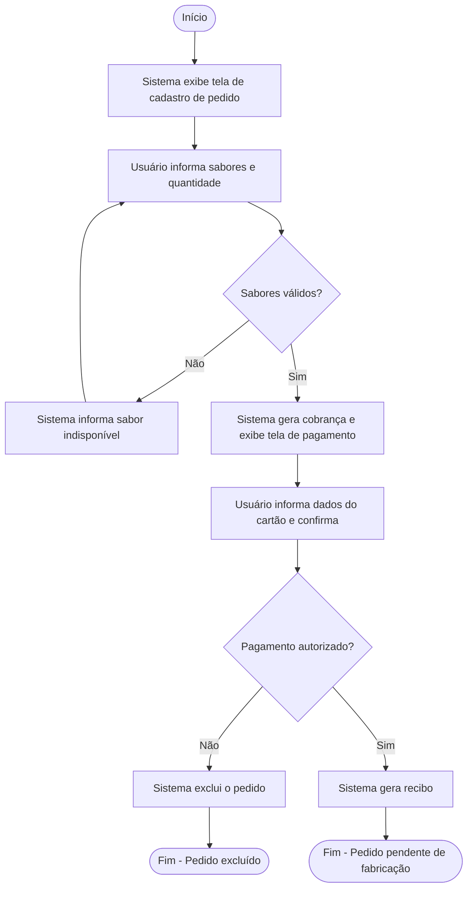
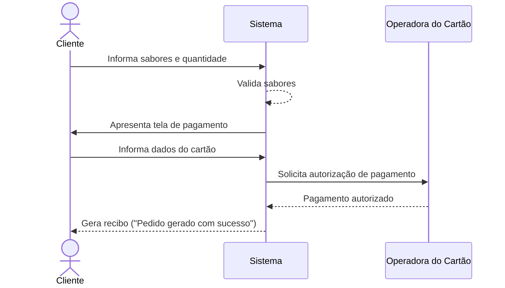
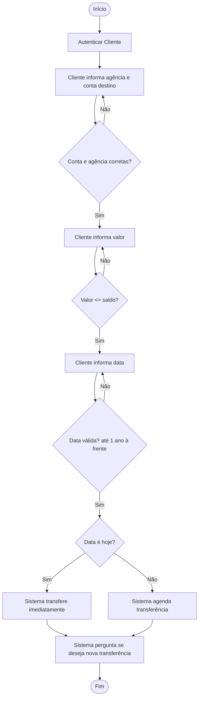
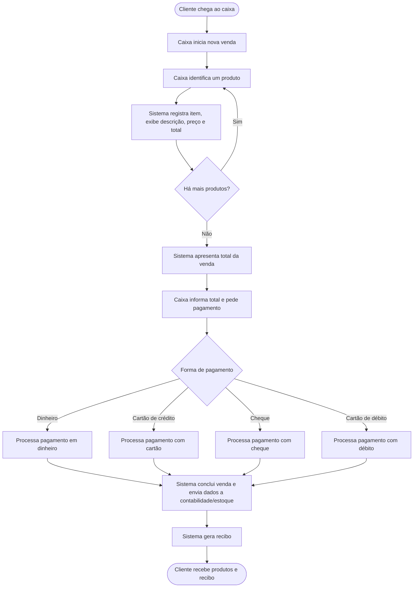
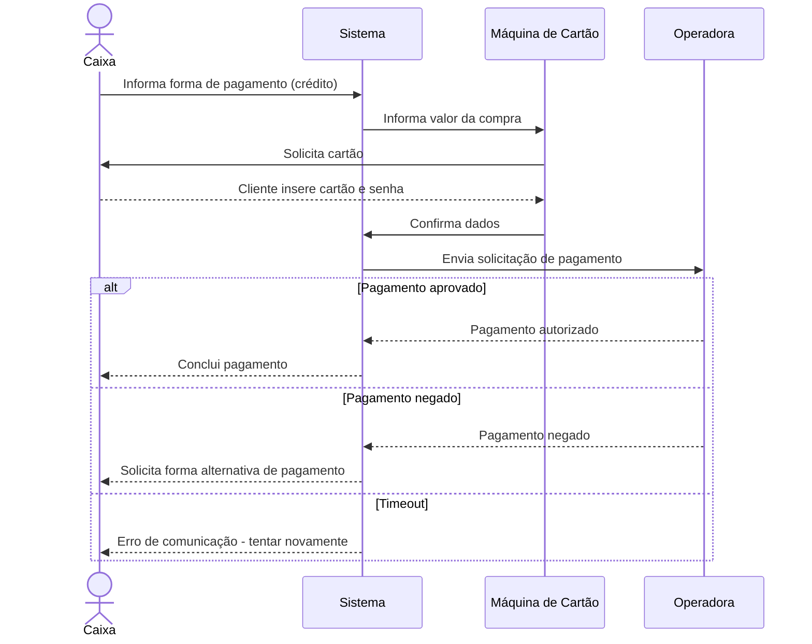
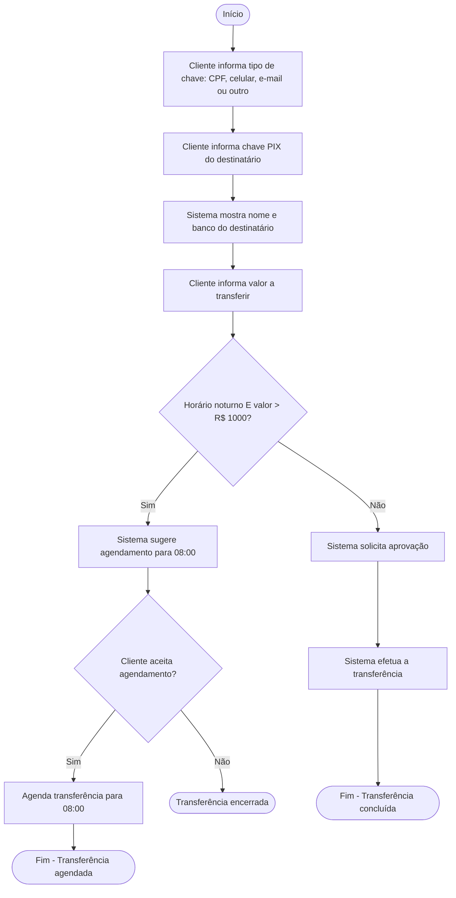

# Casos de Uso

> Material baseado nas notas de aula dos professores Dr. Marco Antonio Torrez Rojas, Dr. Marcello Thiry, Dr. Eduardo Bezerra e MSc. Marcela Leite.

---

## Sumário

1. [Introdução](#introdução)
2. [Utilidades dos Casos de Uso](#utilidades-dos-casos-de-uso)
3. [Finalidade do Caso de Uso](#finalidade-do-caso-de-uso)
4. [Composição do Modelo de Caso de Uso](#composição-do-modelo-de-caso-de-uso)
5. [Formatos de Descrição](#formatos-de-descrição)
6. [Elementos do Caso de Uso](#elementos-do-caso-de-uso)
7. [Cenários](#cenários)
8. [Escrevendo os Cenários](#escrevendo-os-cenários)
9. [Nome do Caso de Uso](#nome-do-caso-de-uso)
10. [Pré-Condições](#pré-condições)
11. [Pós-Condições](#pós-condições)
12. [Identificando Atores e Casos de Uso](#identificando-atores-e-casos-de-uso)
13. [Exemplo: Efetuar Pedido de Pizza](#exemplo-efetuar-pedido-de-pizza)
14. [Exemplo: Transferir Valores entre Contas](#exemplo-transferir-valores-entre-contas)
15. [Exemplo: Venda em Caixa de Supermercado (PDV)](#exemplo-venda-em-caixa-de-supermercado-pdv)
16. [Exercício Resolvido: Transferência via PIX](#exercício-resolvido-transferência-via-pix)
17. [Exercícios Propostos](#exercícios-propostos)
18. [Slides da Aula](#slides-da-aula)
19. [Teste os seus conhecimentos](#teste-os-seus-conhecimentos)

---

## Introdução

O **modelo de casos de uso** é uma representação das funcionalidades externamente observáveis de um sistema e dos elementos externos que interagem com ele.

- Representa os **requisitos funcionais** do sistema.
- Direciona diversas atividades posteriores do **ciclo de vida do software**.
- Força os desenvolvedores a moldar o sistema de acordo com as **necessidades do usuário**.

---

## Utilidades dos Casos de Uso

**Equipe de clientes (validação):**
- Aprovam o que o sistema deverá fazer.
- Entendem o que o sistema deverá fazer.

**Equipe de desenvolvedores:**
- Ponto de partida para **refinar** requisitos de software.
- Podem seguir um **desenvolvimento dirigido a casos de uso**.
- **Designer** (projetista): usa para encontrar classes.
- **Testadores**: usam como base para casos de teste.

---

## Finalidade do Caso de Uso

Descreve como um **usuário interage com o sistema** para executar uma determinada funcionalidade.

- **Usuário**: pode ser um usuário humano, um equipamento ou outro sistema de software.
- **Interação**: deve ter significado para o usuário final e terminar (sair do sistema) com um **estado completo** — concluída ou retornando ao estado inicial.

---

## Composição do Modelo de Caso de Uso

O modelo de casos de uso é composto de duas partes: uma **textual** e outra **gráfica**.

- O diagrama UML usado na parte gráfica é o **diagrama de casos de uso**, também chamado de **diagrama de contexto**, pois dá uma visão global e de alto nível do sistema.
- **Componentes**: casos de uso, atores e relacionamentos entre eles.

Um caso de uso é a **especificação de uma sequência de interações** entre um sistema e os agentes externos. Ele:

- Define parte da funcionalidade do sistema, **sem revelar** a estrutura e o comportamento internos.
- É definido através da **descrição textual** das interações entre o(s) elemento(s) externo(s) e o sistema.

**Exemplo de diagrama de casos de uso (visão gráfica / diagrama de contexto):**

---

## Formatos de Descrição

### Formato Textual (narrativo)

> Este caso de uso inicia quando o Cliente chega ao caixa eletrônico e insere seu cartão. O Sistema requisita a senha do Cliente. Após o Cliente fornecer sua senha e esta ser validada, o Sistema exibe as opções de operações possíveis. O Cliente opta por realizar um saque. Então o Sistema requisita o total a ser sacado. O Cliente fornece o valor da quantidade que deseja sacar. O Sistema fornece a quantia desejada e imprime o recibo para o Cliente. O Cliente retira a quantia e o recibo, e o caso de uso termina.

### Formato de Enumeração (passo a passo)

1. Cliente insere seu cartão no caixa eletrônico.
2. Sistema apresenta solicitação de senha.
3. Cliente digita senha.
4. Sistema valida a senha e exibe menu de operações disponíveis.
5. Cliente indica que deseja realizar um saque.
6. Sistema requisita o valor da quantia a ser sacada.
7. Cliente fornece o valor da quantia que deseja sacar.
8. Sistema fornece a quantia desejada e imprime o recibo para o Cliente.
9. Cliente retira a quantia e o recibo, e o caso de uso termina.

---

## Elementos do Caso de Uso

- **Nome**: descreve a funcionalidade que o caso de uso executa (uma **ação**).
- **Ator**: elemento externo que interage com o sistema.
  - "externo": atores não fazem parte do sistema.
  - "interage": um ator troca informações com o sistema.
- Casos de uso representam uma **sequência de interações** entre sistema e ator (troca de informações).
- Normalmente um agente externo inicia a sequência de interações com o sistema.

### Categorias de Atores

- **Cargos**: Empregado, Cliente, Gerente, Almoxarife, Vendedor, etc.
- **Organizações**: Empresa Fornecedora, Agência de Impostos, Administradora de Cartões, etc.
- **Outros sistemas**: Sistema de Cobrança, Sistema de Estoque de Produtos, etc.
- **Equipamentos**: Leitora de Código de Barras, Sensor, etc.

> O conceito de ator depende do **escopo** do sistema.

### Papel do Ator

Um ator corresponde a um **papel** representado em relação ao sistema — não à pessoa específica.

- O mesmo indivíduo pode ser o **Cliente** que compra mercadorias e o **Vendedor** que processa vendas.
- Uma pessoa pode ser **Funcionário** de um banco que mantém o caixa eletrônico, e também **Cliente** do banco que saca dinheiro.
- O nome dado a um ator deve lembrar seu **papel**, não quem o representa (ex.: "Fornecedor", não "João Fernandes").

---

## Cenários

- **Cenário** = Fluxo = Caminho trilhado pelo ator.
- **Passo** = uma atividade dentro de um cenário.
- **Comportamento** = conjunto finito de cenários.
- Cenários representam todas as diferentes possibilidades de caminhos trilhados pelo ator; cada caminho é uma execução completa do caso de uso, do início ao fim.
- **Pré-Condição**: requisição para execução do cenário.
- **Pós-Condição**: condição final do sistema ou resultado da execução do cenário.

### Tipos de Cenário

| Tipo | Descrição |
|---|---|
| **Cenário Básico** (Fluxo Normal) | Sequência de passos mais usual, na qual a funcionalidade é alcançada com sucesso. |
| **Cenário Alternativo** (Extensão) | Outro caminho possível que também alcança a funcionalidade com sucesso, mas não foi escolhido como cenário básico. |
| **Cenário de Exceção** (Extensão) | Caminho que leva a uma situação de erro, sem sucesso na funcionalidade. |

**Fluxos de execução do cenário** — o fluxo principal pode se ramificar em alternativas e retornar (ou não) ao caminho original:

---

## Escrevendo os Cenários

- A **prototipação da interface** pode facilitar o entendimento sobre os cenários.
- Utilizar **voz ativa**:
  - ✅ "O sistema valida as informações fornecidas."
  - ❌ ~~"As informações fornecidas devem ser validadas pelo sistema."~~
- **Explicitar quem realiza a tarefa** em cada passo:
  - "O sistema `<faz alguma coisa>`"
  - "O `<ator>` `<faz alguma coisa>`"
  - Ex.: "O sistema apresenta uma tela, solicitando o código do livro." / "O funcionário informa o código do livro e confirma."
- **Evitar detalhes específicos de interface**:
  - ❌ ~~"O atendente preenche as informações e aperta o botão Ok."~~
  - ✅ "O atendente preenche as informações e confirma a operação."

---

## Nome do Caso de Uso

**Forma:** `UC<NNN> - <descrição>`

| Elemento | Significado |
|---|---|
| `UC` | Prefixo adotado para representar um caso de uso |
| `<NNN>` | Número sequencial de três dígitos, identifica unicamente o caso de uso |
| `<descrição>` | Nome do caso de uso, iniciando com um verbo no infinitivo |

---

## Pré-Condições

Condição que deve ser **avaliada ANTES** de executar qualquer ação do caso de uso.

> Se você precisa de alguma informação **do próprio caso de uso** para avaliar a condição, então ela é uma **regra de negócio**, e não uma pré-condição.

Perguntas úteis para identificar pré-condições:

- O que deve acontecer antes de fazermos isso?
- O que você precisa garantir antes de realizar tal funcionalidade?
- Algum processamento deve ser garantido antes de executar o caso de uso?
- Existem informações que precisam estar disponíveis antes de executar o caso de uso?

**Exemplos:**
- Os documentos fiscais do ano atual foram gerados.
- Há um ou mais arquivos de banco importados no sistema.
- Há um ou mais processos recebidos com a situação "aguardando avaliação".

> ⚠️ **Nunca** utilize como pré-condição a seleção de uma opção de menu ou uma ação de interface (ex.: "O ator clicou no botão X"). Isso é **inadequado** como pré-condição.

---

## Pós-Condições

Descrevem o **estado do sistema após a conclusão** do caso de uso.

- Devem ser descritas para **cada cenário pertinente** — apenas os que realmente possuem uma pós-condição.

**Exemplo** (cenário básico de "Confirmar Pedido"):

> "O pedido foi confirmado e os dados do cliente foram enviados para o financeiro aprovar seu crédito. O pedido está aguardando esta liberação para ser encaminhado ao setor de despacho."

---

## Identificando Atores e Casos de Uso

### Perguntas para identificar Atores

- Quem são os usuários do sistema atual? E do sistema proposto?
- Quem precisa ter acesso às informações do sistema proposto?
- Quais são os sistemas (software e hardware) que:
  - precisarão de informações do sistema proposto?
  - fornecerão informações para o sistema proposto?

### Perguntas para encontrar Casos de Uso

- Quais as tarefas que os atores irão realizar no sistema proposto?
- Quais as entradas e saídas do sistema? De onde vêm e para onde vão?
- O ator precisa **criar, armazenar, alterar, remover ou consultar** alguma informação no sistema?

---

## Exemplo: Efetuar Pedido de Pizza

### Cenário Básico

| Campo | Descrição |
|---|---|
| **Nome** | UC001 – Efetuar Pedido de Pizza |
| **Objetivo** | O cliente realiza o pedido e o pagamento de sua pizza pelo sistema. |
| **Pré-condições** | O usuário deve estar autenticado no sistema e poder efetuar pedidos. |
| **Ator** | Cliente |

**Passos:**

1. O sistema exibe a tela de cadastro de pedido de pizza.
2. O usuário informa os sabores desejados e a quantidade de pizzas.
3. O sistema valida os sabores informados.
4. O sistema gera a cobrança e apresenta a tela de pagamento.
5. O usuário informa bandeira do cartão, preenche o número, senha e confirma o pagamento.
6. O sistema apresenta o formulário de pagamento.
7. O usuário preenche o número, senha e confirma o pagamento.
8. O sistema valida os dados do pagamento.
9. O sistema gera o recibo de pagamento e apresenta a mensagem "Pedido gerado com sucesso".
10. **Pós-condição:** O pedido está com o status pendente de fabricação.

### Cenário Alternativo A — Sabor inválido (Exceção no Passo 3)

| Campo | Descrição |
|---|---|
| **Pré-condições** | Sabores informados inválidos ou indisponíveis |

**Exceção – Passo 3:**

1. O sistema apresenta a mensagem: *"O sabor selecionado não está disponível no momento. Por favor, informe outro sabor!"*
2. O usuário informa o novo sabor desejado.
3. O sistema retorna para o Passo 4 do Fluxo Principal.
4. **Pós-condição:** Mensagem de erro apresentada ao usuário.

### Cenário Alternativo B — Cobrança negada (Exceção no Passo 8)

| Campo | Descrição |
|---|---|
| **Pré-condições** | Cobrança não autorizada |

**Exceção – Passo 8:**

1. O sistema apresenta a mensagem: *"A operadora retornou mensagem negando o pagamento."*
2. O sistema finaliza o processo e exclui o pedido de pizza realizado.
3. **Pós-condição:** Pedido de pizza excluído.

### Fluxograma do Caso de Uso

### Diagrama de Sequência (cenário básico)

---

## Exemplo: Transferir Valores entre Contas

**Ator:** Cliente do Banco

**Fluxo normal:**

1. Autenticar Cliente
2. Cliente informa agência e conta de destino da transferência
3. Cliente informa valor que deseja transferir
4. Cliente informa a data em que pretende realizar a operação
5. Sistema efetua transferência
6. Sistema pergunta se o cliente deseja realizar uma nova transferência

**Extensões:**

- **2a.** Se conta e agência incorretas, solicitar nova conta e agência
- **3a.** Se valor acima do saldo atual, solicitar novo valor
- **4a.** Data informada deve ser a data atual ou no máximo um ano à frente
- **5a.** Se data informada é a data atual, transferir imediatamente
- **5b.** Se data informada é uma data futura, agendar transferência

> O fluxo normal (passos 1–6) é o **"fluxo feliz"**; as extensões representam **exceções e detalhamentos**.

---

## Exemplo: Venda em Caixa de Supermercado (PDV)

*Fonte: Craig Larman. Applying UML and Patterns. Pearson, 2004.*

### Fluxo Normal

1. Cliente chega no caixa com os produtos que deseja comprar.
2. Caixa inicia uma nova venda.
3. Caixa identifica um produto (ex.: usando leitor de código de barras).
4. Sistema identifica o produto, registra a venda, apresenta a descrição, preço e o total da compra até o momento.
5. Caixa repete os passos 3–4 até não haver mais produtos para registrar.
6. Sistema apresenta o total da venda.
7. Caixa informa o total ao cliente e pede o pagamento.
8. Cliente faz o pagamento e o sistema processa o pagamento.
9. Sistema registra a venda como concluída e envia informações para o sistema de contabilidade e para o sistema de controle de estoques.
10. Sistema gera recibo da venda.
11. Caixa entrega o recibo ao cliente.
12. Cliente encerra a compra, levando os produtos e o recibo.

### Extensões (exemplo apenas para o passo 7 — formas de pagamento)

**7a. Pagamento em dinheiro:**
1. Caixa digita o montante de dinheiro que o cliente forneceu.
2. Sistema informa o valor do troco e libera a gaveta de notas.
3. Caixa deposita o dinheiro na gaveta e retorna o troco ao cliente.
4. Sistema registra e conclui o pagamento com dinheiro.

**7b. Pagamento com cartão de crédito:**
1. Cliente insere o cartão na máquina.
2. Sistema informa à máquina o valor da compra.
3. Cliente informa a senha e confirma a compra.
4. Sistema envia a solicitação de pagamento à operadora do cartão.
   - **4a.** Se erro de comunicação com o sistema da operadora:
     1. Sistema sinaliza erro ao Caixa.
     2. Caixa solicita ao Cliente um modo alternativo de pagamento.
5. Sistema recebe o resultado da requisição de pagamento.
   - **5a.** Pagamento negado:
     1. Sistema avisa o Caixa.
     2. Caixa solicita ao Cliente um modo alternativo de pagamento.
   - **5b.** Timeout na espera pelo resultado:
     1. Sistema avisa o Caixa.
     2. Caixa tenta novamente ou solicita modo alternativo de pagamento.
6. Sistema registra e conclui o pagamento com cartão de crédito.

**7c. Pagamento com cheque:** *(a detalhar)*

**7d. Pagamento com cartão de débito:** *(a detalhar)*

> ⚠️ **Importante:** Casos de uso não são "algoritmos". Ainda estamos levantando requisitos — o foco é o **entendimento e delimitação do problema**, e não em possíveis soluções.

### Fluxograma Geral do Caso de Uso

### Diagrama de Sequência — Pagamento com Cartão de Crédito

---

## Exercício Resolvido: Transferência via PIX

**Ator:** Cliente do banco

**Fluxo normal:**

1. Cliente informa a chave PIX do destinatário.
2. Sistema mostra nome e banco do destinatário.
3. Cliente informa o valor que deseja transferir.
4. Sistema solicita aprovação da transferência.
5. Sistema efetua a transferência.

**Extensões:**

- **1a.** Sistema solicita primeiro o tipo da chave: CPF, celular, e-mail ou outro.
- **3a.** Se horário noturno e valor maior que R$ 1000, sistema informa que o PIX não é possível e sugere agendamento para as 08:00 do dia seguinte.
  - **3a.1.** Se o cliente aceitar o agendamento, prossiga com horário 08:00.
  - **3a.2.** Caso contrário, encerre a transferência.

---

## Exercícios Propostos

### Exercícios I — Casos de Uso

Escolher **um cenário obrigatório** e **um cenário opcional** dentre os sistemas abaixo. Para cada um, especificar:

- Pré-condições
- Fluxo Normal
- Fluxo Alternativo (quando houver)

> Trabalho pode ser feito em dupla.

#### (Opcional) Sistema de EAD

Casos de uso sugeridos:
- Efetuar matrícula
- Acessar conteúdo
- Corrigir atividades/exercícios/avaliações
- Gerenciar curso

#### (Obrigatório) Aplicativo de transporte urbano (tipo Uber)

Com suporte a transporte compartilhado. **Atores:** motorista e passageiro(s).

Casos de uso sugeridos:
- Solicitar Corrida
- Compartilhar Corrida (com contatos de segurança)
- Compartilhar/dividir Corrida com outros passageiros
- Cancelar Corrida
- Avaliar Corrida
- Verificar Localização
- Receber Pagamento

#### (Opcional) Sistema de Prontuário Médico

**Atores:** recepcionista, paciente e médico(a).

Casos de uso sugeridos:
- Agendar/alterar Consulta
- Cancelar Agendamento
- Registrar Prontuário
- Prescrever Receita

### Exercícios II — Livro

Resolver os **exercícios 8 e 9 do Capítulo 3** do livro *Engenharia de Software Moderna* (Marco Tulio Valente).

---

## Referências utilizadas

- PRESSMAN, Roger S.; MAXIM, Bruce R. **Engenharia de Software: Uma Abordagem Profissional**. 9ª ed. McGraw Hill / Bookman, 2021.
- SOMMERVILLE, Ian. **Engenharia de Software**. 10ª ed. Pearson, 2019.
- VALENTE, Marco Tulio. **Engenharia de Software Moderna: Princípios e práticas para desenvolvimento de software com produtividade**. 2023.
- VALENTE, Marco Tulio. **Fundamentos de Manutenção de Software**. 2026.
- YOUREE, Roger K. **Software Reliability Techniques for Real-World Applications**. Wiley, 2023.
- LARMAN, Craig. **Applying UML and Patterns**. Pearson, 2004.

---

## Slides da Aula
 - [Casos de Uso](https://canva.link/k3wujiefzfk35rh)

---

## Teste os seus conhecimentos
 - [Casos de Uso](https://mehranmisaghi.github.io/ESW-II/materiais/quiz-casos-de-usos.html)