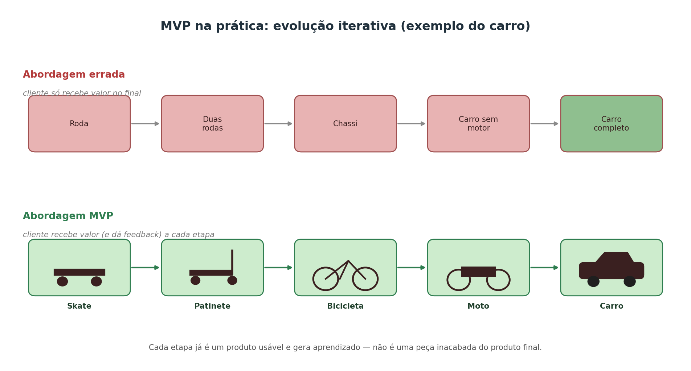
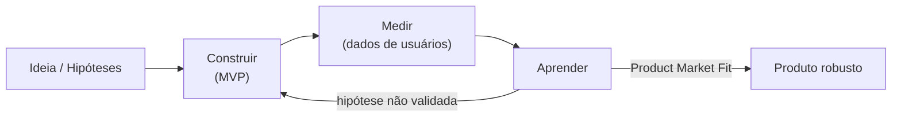
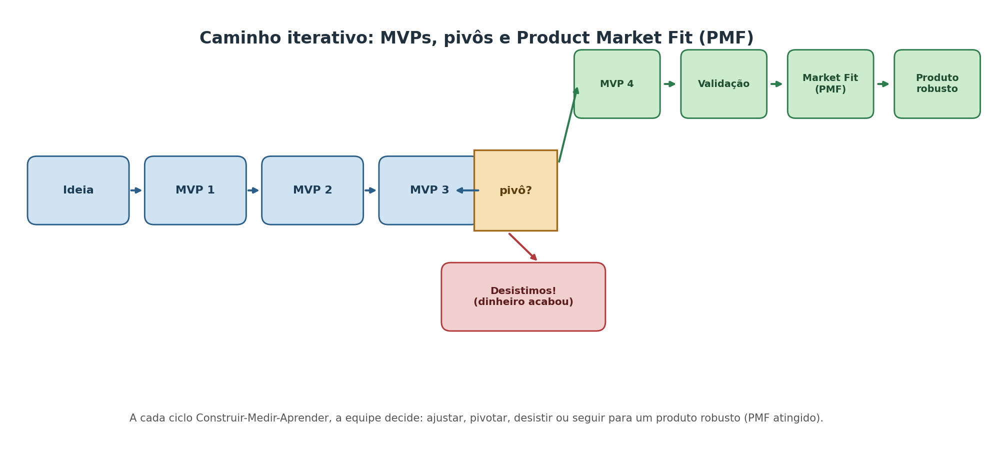

## Sumário

1. [Origem do conceito](#1-origem-do-conceito)
2. [Tipos de sistemas: risco](#2-tipos-de-sistemas-risco)
3. [O que é MVP](#3-o-que-é-mvp)
4. [O que o MVP não é](#4-o-que-o-mvp-não-é)
5. [Tipos comuns de pivô](#5-tipos-comuns-de-pivô)
6. [Exemplos clássicos de MVP](#6-exemplos-clássicos-de-mvp)
7. [Exercícios para fazer](#7-exercicios-para-fazer)
8. [Material para estudar](#8-material-para-estudar)

---

## 1. Origem do conceito

O MVP tem origem no livro **"The Lean Startup"** (Eric Ries, 2011), que aplica ao mundo das startups os **princípios do Lean** (pensamento enxuto). As ideias centrais herdadas do Lean são:

- **Validação** de hipóteses antes de investir pesado;
- **Eliminação de desperdício** (esforço colocado em algo que não gera valor);
- **Aprendizado validado** — aprender rápido, com dados reais, se uma ideia funciona ou não.

### 1.1 O que é o pensamento enxuto (Lean)?

Surgiu no **pós-Segunda Guerra Mundial**, no Japão, durante a reconstrução industrial. Com escassez de matéria-prima, espaço e capital, tornou-se essencial reduzir estoques, tempo de espera, retrabalho e outras formas de desperdício. A **Toyota** desenvolveu um sistema de produção voltado à eliminação de desperdícios e ao aumento de produtividade — a base do pensamento enxuto.

**Taiichi Ohno**, considerado o "pai" do pensamento enxuto, criou o **Sistema Toyota de Produção**, com dois pilares:
- **Just-in-Time (JIT):** produzir apenas o necessário, quando necessário;
- **Jidoka:** interromper o processo diante de anomalias, para preservar a qualidade.

**Princípios fundamentais do Lean:**
1. **Eliminação de desperdícios (Muda):** remover o que não agrega valor ao cliente;
2. **Fluxo contínuo de produção:** menos interrupções e esperas;
3. **Melhoria contínua (Kaizen):** pequenos avanços constantes, com toda a equipe;
4. **Produção puxada (Just-in-Time):** produzir só o necessário, na hora certa.

**Impacto:** transformou a manufatura global, expandiu-se para serviços e deu origem a metodologias como o **Lean Six Sigma**.

### 1.2 Lean aplicado à Engenharia de Software e TI

- **Desenvolvimento de software:** maximizar valor entregue, reduzir código desnecessário/retrabalho/esperas, adotar **CI/CD**; métodos ágeis ampliam isso com ciclos curtos e aprendizado rápido.
- **Infraestrutura de TI:** sair do provisionamento excessivo e processos manuais lentos (abordagem tradicional) para automação, infraestrutura como código e uso eficiente de recursos (abordagem Lean) → menos custo, mais agilidade e confiabilidade.
- **Governança de TI:** simplificar aprovações e compliance, monitorar com dados/indicadores, decidir de forma colaborativa mantendo o foco no valor entregue.

---

## 2. Tipos de sistemas: risco

| | Baixo risco | Alto risco |
|---|---|---|
| Características | Usuários conhecidos, necessidade clara | Sucesso incerto, inovação necessária |
| Exemplos de propósito | Controle de empréstimos, gestão de usuários | Validação rápida, testes de mercado |
| Exemplo real | **SWIFT** (rede bancária global, presente em +200 países) | **Bitcoin** |

Pergunta disparadora: seria possível criar uma loja virtual sem depender de um sistema como o SWIFT? — sistemas de baixo risco tendem a ser infraestrutura essencial já validada; sistemas de alto risco são onde o MVP faz mais sentido.

---

## 3. O que é MVP

**MVP = Produto Mínimo Viável**, decomposto em três perguntas:

- **Produto** → pode ser usado (funciona de verdade, ainda que de forma simples);
- **Mínimo** → menor conjunto de funcionalidades possível (menor custo/esforço);
- **Viável** → terá mercado? Existe demanda real?

**Ideia central:** construir a versão mais simples possível de um produto para testar uma hipótese de negócio com o menor investimento possível.

### 3.0 MVP na prática: entrega incremental (exemplo do carro)

A imagem abaixo ilustra a diferença entre construir por partes (o cliente só recebe algo utilizável no final) e construir um MVP (cada etapa já é usável e gera aprendizado):

### 3.1 Ciclo Construir–Medir–Aprender

1. **Construir**: a partir de uma ideia/hipótese, cria-se o MVP;
2. **Medir**: coleta-se dados reais de uso com usuários;
3. **Aprender**: analisa-se os dados para validar (ou não) a hipótese — e o ciclo recomeça.

### 3.2 Ao final de cada ciclo, quatro caminhos possíveis

1. **Ajustar** pequenos pontos e rodar o ciclo de novo;
2. **Pivotar**: fazer ajustes grandes e rodar o ciclo de novo;
3. **Desistir** (o dinheiro/tempo acabou);
4. **Deu certo**: atingiu-se o **Product Market Fit (PMF)** → agora constrói-se um produto robusto.

Cada iteração pode gerar um novo MVP (MVP1 → MVP2 → MVP3...) até encontrar o encaixe com o mercado (Market Fit) ou até a equipe desistir:

### 3.3 Vantagens do MVP

- **Redução de custos** — investe-se apenas o essencial;
- **Validação com dados reais** — feedback direto de usuários reais, não suposições;
- Reduz o risco de construir "no escuro" algo que ninguém quer.

### 3.4 Quando o MVP faz sentido

Cenário ideal: quando ainda **não se sabe** se o produto vai dar certo. Frase de referência (atribuída a Henry Ford):

> "Se eu tivesse perguntado para meus clientes o que eles queriam, a resposta teria sido um cavalo mais rápido."

Isso ilustra que o MVP serve para testar **hipóteses de negócio**, muitas vezes sobre necessidades que o próprio cliente ainda não sabe formular.

---

## 4. O que o MVP não é

- **MVP ≠ primeira versão do produto.** Uma "v1" completa não é necessariamente um MVP.
- **MVP é um experimento — logo, pode falhar.** Se já se sabe de antemão que vai dar certo (mercado certo, cliente já contratou e vai pagar, equipe já tem competência, cliente sabe exatamente o que quer), **não há risco** e, portanto, **não é necessário MVP** — não seria um experimento de verdade.

### 4.1 MVP e boas práticas de Engenharia de Software

- Um MVP **não precisa** aplicar todas as boas práticas de Engenharia de Software (testes de unidade completos, refatorações extensas, arquitetura complexa etc.) — se a ideia validar, o sistema pode ser reimplementado depois.
- Porém, alguns **requisitos não funcionais** ainda podem ser críticos mesmo no MVP: desempenho, usabilidade, estabilidade, entre outros — dependendo do contexto.

### 4.2 Quanto tempo leva um MVP?

Varia bastante, mas **precisa ser rápido** (ex.: da ordem de duas semanas). Frase de referência (Reid Hoffman):

> "Se você não tiver vergonha do seu MVP, você demorou demais para lançá-lo."

---

## 5. Tipos comuns de pivô

Quando um MVP não valida a hipótese, a equipe pode **pivotar** (mudar de direção mantendo aprendizados). Tipos comuns:

1. **Zoom-in** — uma funcionalidade específica vira o produto principal;
2. **Segmento de clientes** — muda-se o público-alvo;
3. **Aplicação → Plataforma** — de um produto fechado para uma plataforma que hospeda outros;
4. **Tecnologia** — muda-se a tecnologia/base do produto, mantendo o propósito.

### Exemplos de pivô

- **Zoom-in — Flickr:** começou como um jogo online multiplayer ("massive multiplayer role-playing game"); a funcionalidade de compartilhar fotos entre jogadores fez tanto sucesso que virou o próprio produto (Flickr).
- **Zoom-in — Slack:** história parecida — nasceu de um jogo de RPG online e pivotou para um aplicativo de mensagens corporativas.
- **Segmento de clientes — Twitch:** começou como justin.tv (streaming amplo, qualquer conteúdo) e migrou o foco para gamers (Twitch.tv).
- **Aplicação → Plataforma — Shopify:** começou como uma loja online para alugar equipamentos de esqui e virou uma plataforma para hospedar lojas online de terceiros.
- **Tecnologia — Android:** começou como sistema operacional para câmeras digitais e pivotou para sistema operacional de celulares.

---

## 6. Exemplos clássicos de MVP

| Empresa | MVP inicial | Hipótese testada |
|---|---|---|
| **Zappos** (1999) | Site simples com fotos de sapatos de lojas físicas; backend 100% manual | As pessoas comprariam sapatos pela internet? |
| **Facebook** (2004) | "Thefacebook", rede social fechada só para universitários | Havia interesse em uma rede social fechada? |
| **Dropbox** (2007) | Vídeo explicativo de até 3 minutos (sem produto funcional ainda) | As pessoas veriam valor em sincronização de arquivos na nuvem? |
| **Airbnb** (2008) | 3 colchões infláveis disponibilizados para teste | As pessoas topariam essa experiência de hospedagem? |

**Contraexemplo — Canva:** a primeira versão levou **um ano** para ser lançada; por isso, provavelmente não deveria ser chamada de MVP (fugiu do princípio de rapidez/mínimo).

---

## 7. Exercícios para fazer

1. Qual a diferença entre um MVP e uma pesquisa de mercado?
2. Como implementar um MVP para um sistema de caronas para alunos do IFC **sem escrever código**?
3. Se o primeiro MVP falhar, descreva um possível pivô.
4. Descreva um domínio/aplicação em que é mais difícil criar um MVP. Justifique.
5. Os "protótipos de cozinha desenhados a giz" do McDonald's (antes de sua fundação) podem ser considerados MVPs? Por quê? (Fonte: filme *The Founder*)
6. Para um app de monitoramento de consumo de água, quais funcionalidades pertenceriam ao MVP: inserção manual, integração com smartwatch, relatórios/gráficos, notificações, compartilhamento em redes sociais?

---

## 8. Material para estudar

- [Capítulo 3 do livro](https://engsoftmoderna.info/cap3.html)
- [Slides da aula](https://canva.link/hpewzne564xi7xb)
- [Questões de Concurso sobre MVP:](https://mehranmisaghi.github.io/ESW-II/materiais/quiz_mvp.html)

