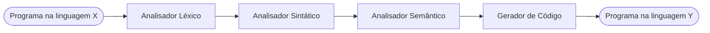
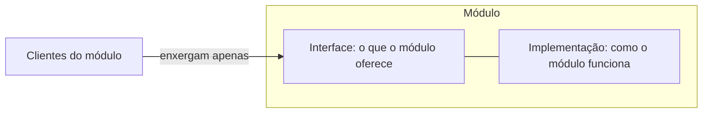
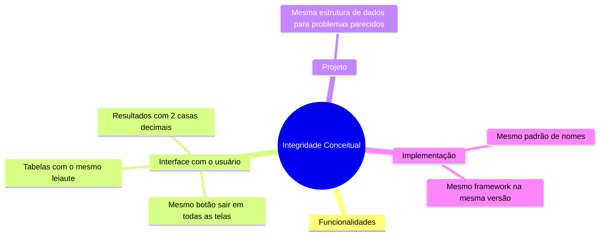
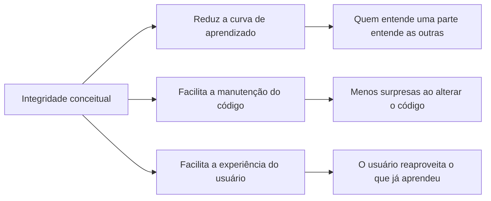

# Integridade Conceitual — Notas de Aula

**Disciplina:** Engenharia de Software II
**Professor:** Mehran Misaghi
**Série:** Princípios de Projeto (Parte I) — página 1 de 4

> **Nesta série:** **1. Integridade Conceitual** · [2. Ocultamento de Informação](principios_projeto_2_ocultamento_informacao.md) · [3. Coesão](principios_projeto_3_coesao.md) · [4. Acoplamento](principios_projeto_4_acoplamento.md)

---

## Sumário

1. [Antes de começar: o que é projeto de software](#1-antes-de-começar-o-que-é-projeto-de-software)
2. [O que é integridade conceitual](#2-o-que-é-integridade-conceitual)
3. [Onde a integridade conceitual se aplica](#3-onde-a-integridade-conceitual-se-aplica)
4. [Exemplos na interface com o usuário](#4-exemplos-na-interface-com-o-usuário)
5. [Exemplos em nível de projeto e código](#5-exemplos-em-nível-de-projeto-e-código)
6. [Por que buscar integridade conceitual](#6-por-que-buscar-integridade-conceitual)
7. [Pontos-chave para revisão](#7-pontos-chave-para-revisão)
8. [Exercícios](#8-exercícios)
9. [Material para estudar](#9-material-para-estudar)

---

## 1. Antes de começar: o que é projeto de software

Imagine a tarefa de **implementar um compilador**. Visto como uma coisa só, o problema é grande demais para caber na cabeça de uma pessoa. A saída é a estratégia mais antiga da computação: **dividir para conquistar**, isto é, quebrar um "problema grande" em partes menores que possam ser entendidas e implementadas separadamente.



Essa decomposição **é** o projeto (*design*) de software. Cada uma das "partes menores" recebe o nome de **módulo**. Dependendo da escala, um módulo pode ser uma função, uma classe, um pacote, uma biblioteca, um microsserviço etc.

Todo módulo tem duas faces:

> **Módulo = interface + implementação**



Nem toda decomposição é boa. Nesta série estudamos quatro **propriedades de bons projetos**, uma por página:

| # | Propriedade | Pergunta que ela responde |
|---|---|---|
| 1 | **Integridade Conceitual** (esta página) | O sistema é coerente, ou parece um amontoado de decisões diferentes? |
| 2 | [Ocultamento de Informação](principios_projeto_2_ocultamento_informacao.md) | O que cada módulo esconde e o que ele expõe? |
| 3 | [Coesão](principios_projeto_3_coesao.md) | Cada módulo faz uma única coisa? |
| 4 | [Acoplamento](principios_projeto_4_acoplamento.md) | Qual a qualidade das dependências entre os módulos? |

Na Parte II da aula, essas propriedades dão origem a princípios mais específicos: Responsabilidade Única, Segregação de Interfaces, Prefira Interfaces a Classes, Aberto/Fechado, Demeter e Substituição de Liskov.

---

## 2. O que é integridade conceitual

**Integridade conceitual** é a propriedade de um sistema cujas partes seguem as **mesmas ideias, regras e convenções**. Um sistema com integridade conceitual parece ter sido projetado por uma única mente, mesmo quando foi construído por muitas pessoas. Um sistema sem ela é um conjunto de funcionalidades sem coerência entre si.

A propriedade foi defendida por **Frederick Brooks** no livro *The Mythical Man-Month* (1975):

> "Integridade conceitual é a consideração mais importante no projeto de sistemas." — Fred Brooks

| Fred Brooks | *The Mythical Man-Month* |
|:---:|:---:|
|  |  |

### Integridade conceitual em uma imagem

Uma boa forma de fixar o conceito é pensar em cidades. Em uma cidade planejada, quadras, vias e áreas verdes seguem um mesmo plano. Em uma ocupação sem plano comum, cada construção resolve o seu problema de um jeito, com forma, cor e altura próprias.

| ✅ Exemplo | ❌ Contra-exemplo |
|:---:|:---:|
|  |  |

No contra-exemplo, cada prédio pode até ser bom isoladamente. O que falta é a coerência do conjunto. Em software acontece o mesmo: cada tela ou classe pode funcionar, e ainda assim o sistema ser difícil de aprender e de manter.

> **Observação do livro-texto:** integridade conceitual não exige que uma única pessoa decida tudo. Mas decisões tomadas por comitês, em que cada membro insere a "sua" funcionalidade, tendem a produzir sistemas inchados. É a ideia por trás da frase "um camelo é um cavalo projetado por um comitê".

---

## 3. Onde a integridade conceitual se aplica

A propriedade vale para **todos os níveis** de um sistema, do que o usuário vê até o que só o desenvolvedor vê:



---

## 4. Exemplos na interface com o usuário

Um sistema tem integridade conceitual na interface quando o usuário **aprende uma vez e reaproveita em todas as telas**:

- o botão **"sair"** é idêntico em todas as telas (mesmo texto, mesma posição, mesmo comportamento);
- se o sistema usa **tabelas** para apresentar resultados, todas as tabelas têm o **mesmo leiaute**;
- todos os resultados numéricos são mostrados com **2 casas decimais**.

O livro-texto cita contra-exemplos do mesmo tipo: tabelas que podem ser ordenadas em algumas telas e em outras não, ou valores mostrados ora em reais, ora em dólares.

---

## 5. Exemplos em nível de projeto e código

A mesma ideia vale para quem lê o código:

**(a) Todas as variáveis seguem o mesmo padrão de nomes.** O contra-exemplo clássico é misturar *snake_case* e *camelCase* no mesmo sistema:

```java
// ❌ Sem integridade conceitual: dois padrões de nomes
double nota_total;
double notaMedia;

// ✅ Com integridade conceitual: um único padrão
double notaTotal;
double notaMedia;
```

**(b) Todas as páginas usam o mesmo framework, na mesma versão.** Dois frameworks para o mesmo fim obrigam a equipe a conhecer, configurar e atualizar os dois.

**(c) Problemas parecidos têm soluções parecidas.** Se um problema é resolvido com uma estrutura de dados X, todos os problemas parecidos também usam X.

---

## 6. Por que buscar integridade conceitual



A lista fica em aberto de propósito (o slide termina com "Outros?"): o exercício 5 pede que você a complete.

---

## 7. Pontos-chave para revisão

- **Projeto de software** é dividir um problema grande em **módulos**; cada módulo tem **interface** e **implementação**.
- **Integridade conceitual** = o sistema segue as mesmas ideias e convenções em todas as suas partes.
- Vale para **funcionalidades, interface com o usuário, projeto e implementação**.
- Para Brooks, é **a consideração mais importante** no projeto de sistemas.
- Benefícios: **menor curva de aprendizado**, **manutenção mais fácil** e **melhor experiência do usuário**.
- Sinais de alerta: dois padrões de nomes, dois frameworks para o mesmo fim, telas que resolvem a mesma coisa de formas diferentes.

---

## 8. Exercícios

**1.** Observe os dois slides de abertura abaixo, retirados de aulas da mesma disciplina. Por que falta integridade conceitual entre eles? Aponte pelo menos três diferenças.

| Slide A | Slide B |
|:---:|:---:|
|  |  |

**2.** Explique, com suas palavras, a analogia entre a cidade planejada e a ocupação sem plano comum (Seção 2). O que seria, em um sistema de software, o equivalente ao "plano da cidade"?

**3.** A classe abaixo compila e funciona. Mesmo assim, ela tem pelo menos quatro problemas de integridade conceitual. Identifique-os e reescreva a classe.

```java
class Boletim {
    private double nota_total;
    private double notaMedia;
    private ArrayList<Double> notasProva1;
    private double[] notas_prova2;

    public double getNotaTotal() { ... }
    public double calcular_media() { ... }
    public void ImprimeBoletim() { ... }
}
```

**4.** Um aplicativo de banco tem os seguintes comportamentos. Para cada um, diga em qual nível a integridade conceitual é violada (funcionalidades, interface com o usuário, projeto ou implementação) e proponha uma regra que resolva o problema.

- (a) Na tela de extrato, o botão de saída se chama "Sair" e fica no canto superior direito; na tela de Pix, ele se chama "Encerrar sessão" e fica dentro de um menu.
- (b) O extrato mostra datas como `07/10/2026`; os comprovantes mostram `2026-10-07`.
- (c) Metade dos módulos acessa o banco de dados por um ORM; a outra metade escreve SQL diretamente.
- (d) O saldo aparece com 2 casas decimais na tela inicial e com 4 casas na tela de investimentos, sem explicação.

**5.** O slide de benefícios termina com "Outros?". Cite dois benefícios da integridade conceitual além dos três estudados na Seção 6 e justifique cada um.

**6.** Uma equipe de 12 pessoas vai iniciar um sistema novo. Proponha três mecanismos concretos (de processo ou de ferramenta) para que a integridade conceitual seja mantida ao longo do tempo, e não apenas no primeiro mês.

**7.** *(Para discussão)* Escolha um aplicativo ou site que você usa todos os dias. Encontre nele um exemplo e um contra-exemplo de integridade conceitual. Como o contra-exemplo afeta o seu uso?

---

## 9. Próximo Assunto

- [2. Ocultamento de Informação](principios_projeto_2_ocultamento_informacao.md)
