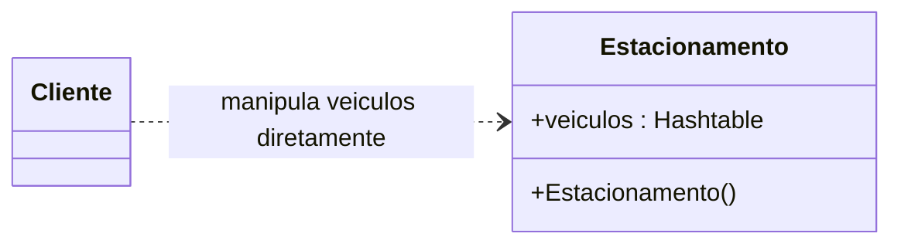
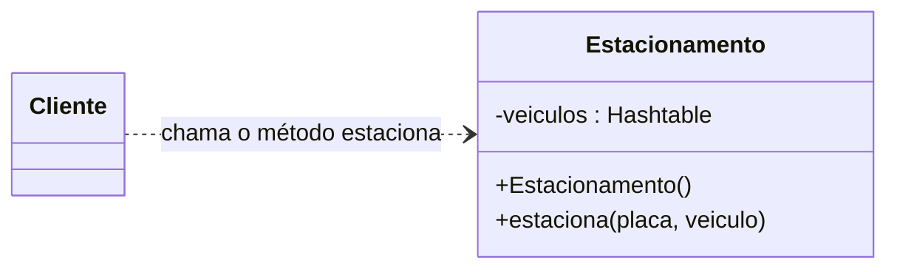
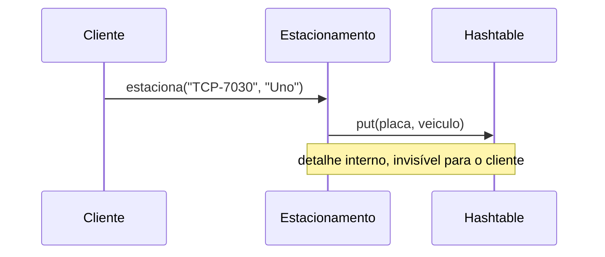
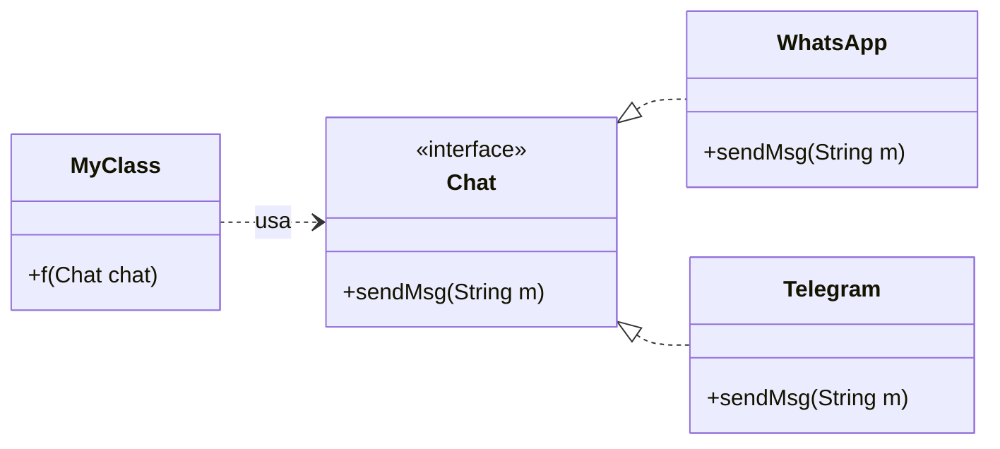

# Ocultamento de Informação — Notas de Aula

**Disciplina:** Engenharia de Software II
**Professor:** Mehran Misaghi
**Série:** Princípios de Projeto (Parte I) — página 2 de 4

> **Nesta série:** [1. Integridade Conceitual](principios_projeto_1_integridade_conceitual.md) · **2. Ocultamento de Informação** · [3. Coesão](principios_projeto_3_coesao.md) · [4. Acoplamento](principios_projeto_4_acoplamento.md)

---

## Sumário

1. [Origem do conceito](#1-origem-do-conceito)
2. [O que é ocultamento de informação](#2-o-que-é-ocultamento-de-informação)
3. [Exemplo sem ocultamento](#3-exemplo-sem-ocultamento)
4. [Exemplo com ocultamento](#4-exemplo-com-ocultamento)
5. [Os significados da palavra interface](#5-os-significados-da-palavra-interface)
6. [A metáfora do iceberg](#6-a-metáfora-do-iceberg)
7. [Pontos-chave para revisão](#7-pontos-chave-para-revisão)
8. [Exercícios](#8-exercícios)
9. [Próximo Assunto](#9-próximo-assunto)

---

## 1. Origem do conceito

O conceito de **ocultamento de informação** (*information hiding*) foi proposto por **David Parnas** em 1972, no artigo *On the Criteria To Be Used in Decomposing Systems into Modules*. A tese do artigo é que a qualidade de uma modularização depende do **critério** usado para dividir o sistema, e que o melhor critério é: cada módulo esconde uma decisão de projeto.

| O artigo de 1972 | David Parnas |
|:---:|:---:|
|  |  |

---

## 2. O que é ocultamento de informação

> **Ocultar os detalhes de implementação** de um módulo, componente ou classe, expondo apenas uma **interface estável e mínima**.

Na aula destacamos dois ganhos imediatos:

- **facilita a manutenção do código**, que passa a ser feita de forma mais direcionada (quem altera um detalhe interno sabe que só precisa olhar para dentro do módulo);
- **contribui para a segurança dos dados**, pois ninguém de fora altera o estado interno diretamente.

O livro-texto, seguindo Parnas, lista ainda três vantagens:

| Vantagem | Por quê |
|---|---|
| **Desenvolvimento em paralelo** | Equipes diferentes trabalham em módulos diferentes, combinando apenas as interfaces |
| **Flexibilidade a mudanças** | A implementação de um módulo pode ser trocada sem afetar os demais |
| **Facilidade de entendimento** | Cada desenvolvedor só precisa conhecer a fundo os módulos sob sua responsabilidade |

O que deve ser escondido? Principalmente as decisões **sujeitas a mudanças**: estruturas de dados, algoritmos, formatos de arquivo, detalhes de requisitos.

---

## 3. Exemplo sem ocultamento

A classe abaixo controla os veículos de um estacionamento. Ela funciona, mas tem um problema de projeto:

```java
import java.util.Hashtable;

public class Estacionamento {

  public Hashtable<String, String> veiculos;   // ❌ estrutura de dados exposta

  public Estacionamento() {
    veiculos = new Hashtable<String, String>();
  }

  public static void main(String[] args) {
    Estacionamento e = new Estacionamento();
    e.veiculos.put("TCP-7030", "Uno");         // ❌ cliente manipula
    e.veiculos.put("BNF-4501", "Gol");         //    a tabela hash
    e.veiculos.put("JKL-3481", "Corsa");       //    diretamente
  }
}
```

**Problema:** os clientes precisam manipular uma estrutura de dados **interna** da classe para estacionar um veículo.



### Comparação com um estacionamento manual

| A guarita | O caderno de controle |
|:---:|:---:|
|  |  |

Em um estacionamento com controle manual, quem anota a placa no caderno é o funcionário da guarita. O código acima equivale a deixar **cada motorista entrar na guarita e escrever no caderno com a própria mão**. Funciona enquanto todos escrevem do mesmo jeito, mas o estacionamento perde o controle sobre o próprio caderno.

Classes também precisam de um pouco de **"privacidade"**, até para **evoluir de forma independente dos clientes**. No código anterior, se a classe trocar a `Hashtable` por outra estrutura, todos os clientes quebram.

---

## 4. Exemplo com ocultamento

A nova versão faz três mudanças, numeradas no código:

```java
import java.util.Hashtable;

public class Estacionamento {

  private Hashtable<String,String> veiculos;               // (1) atributo agora é private

  public Estacionamento() {
    veiculos = new Hashtable<String, String>();
  }

  public void estaciona(String placa, String veiculo) {    // (2) novo método público
    veiculos.put(placa, veiculo);
  }

  public static void main(String[] args) {
    Estacionamento e = new Estacionamento();
    e.estaciona("TCP-7030", "Uno");                        // (3) clientes chamam
    e.estaciona("BNF-4501", "Gol");                        //     o método
    e.estaciona("JKL-3481", "Corsa");
  }
}
```

**Resultado:** a classe `Estacionamento` fica livre para alterar a sua estrutura de dados interna.



O que o cliente enxerga agora é só a troca de mensagens abaixo. A `Hashtable` virou um detalhe interno:



### Resumo das regras

- Classes devem **ocultar detalhes internos** de sua implementação, usando o modificador **`private`**.
- Principalmente aqueles **sujeitos a mudanças**.
- Adicionalmente, a **interface da classe deve ser estável**.
- **Interface** = conjunto de métodos públicos de uma classe.

> **Atenção (livro-texto):** tornar atributos `private` e criar um `get` e um `set` para cada um **não garante** ocultamento de informação. Se todo o estado interno continua acessível por esses métodos, a informação continua vazando. Use getters e setters apenas quando o cliente realmente precisar do dado.

---

## 5. Os significados da palavra interface

A palavra **interface** aparece com três sentidos diferentes:

| # | Significado | Exemplo |
|---|---|---|
| 1 | **Conjunto de métodos públicos de uma classe** | `estaciona(placa, veiculo)` é a interface de `Estacionamento` |
| 2 | **Construção de uma linguagem** (palavra reservada) | `interface Chat { ... }` em Java |
| 3 | Interface com o usuário (UI), interface gráfica (GUI), interface mobile etc. | Telas e botões — *fora do escopo deste curso* |

### Interface em Java

```java
// Código mantido por um time X
interface Chat {
  void sendMsg(String m);
}

class WhatsApp implements Chat {
  public void sendMsg(String m) {
    ...
  }
}

class Telegram implements Chat {
  public void sendMsg(String m) {
    ...
  }
}
```

```java
// Código mantido por um time Y
class MyClass {
  public void f(Chat chat) {   // aceita WhatsApp, Telegram etc.
    ...
    chat.sendMsg(...);
    ...
  }
}
```



O time Y só conhece `Chat`. O time X pode alterar `WhatsApp`, alterar `Telegram` ou criar uma terceira implementação sem que `MyClass` precise mudar.

> **Importante:** mesmo que uma classe não implemente uma interface (palavra reservada), ela **possui** uma interface (seus métodos públicos).

---

## 6. A metáfora do iceberg

Bons módulos são semelhantes a **icebergs**: uma pequena parte pública e visível; uma grande parte submersa e privativa.


*Adaptado de: Bertrand Meyer, Object-Oriented Software Construction, 1997 (pág. 51).*

A metáfora vale em qualquer escala:

| Escala | Parte pública (visível) | Parte secreta (submersa) |
|---|---|---|
| **Sistema** | API (REST, gRPC, GraphQL) | Sistema completo |
| **Classe** | Assinatura dos métodos públicos | Implementação dos métodos públicos; métodos privados |
| **Função** | Assinatura da função ou método | Implementação da função ou método |

---

## 7. Pontos-chave para revisão

- Conceito proposto por **David Parnas (1972)**: módulos devem esconder decisões de projeto sujeitas a mudanças.
- **Ocultar** a implementação; **expor** uma interface **estável e mínima**.
- Em Java: atributos `private` + métodos públicos bem escolhidos.
- **Interface** tem três significados; os dois que interessam aqui são "métodos públicos de uma classe" e a palavra reservada `interface`.
- Toda classe tem uma interface, mesmo sem usar `implements`.
- **Iceberg:** pouco visível, muito submerso — vale para sistemas, classes e funções.
- `get`/`set` para tudo **não** é ocultamento de informação.

---

## 8. Exercícios

**1.** *(Exercício da aula)* Seja o seguinte código, que realiza operações em um conjunto de contas bancárias:

```javascript
var saldo = [150, 10, 90]; // global

function depositar(conta, valor) {
  saldo[conta] += valor;
}

function getSaldo(conta) {
  return saldo[conta];
}
```

- (a) Qual propriedade de projeto é violada por esse código?
- (b) Como você melhoraria o design desse código?

**2.** *(Exercício da aula)* Seguem duas modularizações de um programa que lê um conjunto de linhas da entrada, cria todos os "shifts circulares" dessas linhas e depois imprime os shifts em ordem alfabética. Qual das duas modularizações é melhor? Qual propriedade de projeto ela atende (em detrimento da outra)?

| Modularização I | Modularização II |
|:---:|:---:|
|  |  |

*Fonte das figuras: [riverandsoftware.com](https://www.riverandsoftware.com/p/criteria-to-be-used-in-modularisation-paper).*

**3.** Analise a classe abaixo e o trecho de código cliente.

```java
public class ContaBancaria {
  public double saldo;
  public ArrayList<String> extrato = new ArrayList<String>();
}

// código cliente
conta.saldo = conta.saldo - 200;
conta.extrato.add("Saque: 200");
```

- (a) Liste dois problemas que podem acontecer porque `saldo` e `extrato` são públicos.
- (b) Reescreva a classe aplicando ocultamento de informação.
- (c) Cite uma mudança interna que passa a ser possível, na sua versão, sem alterar nenhum cliente.

**4.** Para cada item, diga qual é a **parte pública** e qual é a **parte secreta** do iceberg:

- (a) a API REST de um sistema de pagamentos;
- (b) uma classe `Pilha` com os métodos `push`, `pop` e `size`;
- (c) uma função `ordenar(lista)`.

**5.** Julgue cada afirmação como verdadeira ou falsa e **justifique**:

- (a) "Se todos os atributos de uma classe são `private` e possuem `get` e `set` públicos, a classe oculta informação."
- (b) "Uma classe que não usa a palavra reservada `interface` não tem interface."
- (c) "Alterar a assinatura de um método público é uma mudança barata, pois só afeta a própria classe."
- (d) "Ocultamento de informação permite que duas equipes trabalhem em paralelo."

**6.** Uma loja virtual aceita pagamento por Pix e por cartão, e novos meios de pagamento devem surgir. Modele, com um diagrama de classes em Mermaid, uma interface `Pagamento`, duas implementações e uma classe `Loja` que dependa apenas da interface. Depois responda: o que a equipe da `Loja` precisa saber sobre a implementação do Pix?

**7.** *(Para discussão)* Por que o texto recomenda esconder "principalmente" o que está sujeito a mudanças? Dê um exemplo de detalhe que muda com frequência e um exemplo de algo que raramente muda em um sistema que você conhece.

---

## 9. Próximo assunto
- [3. Coesão](principios_projeto_3_coesao.md)

