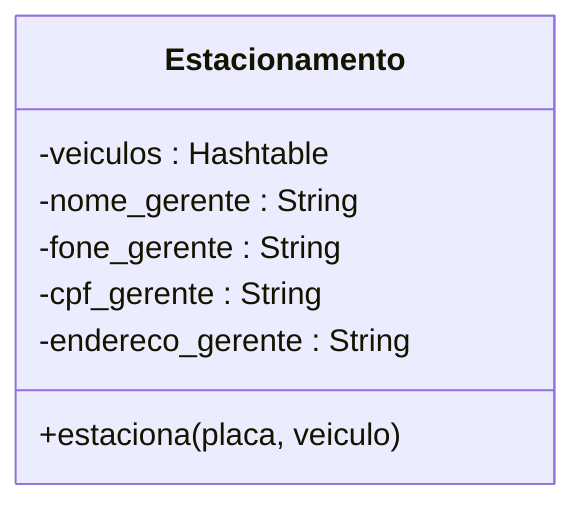
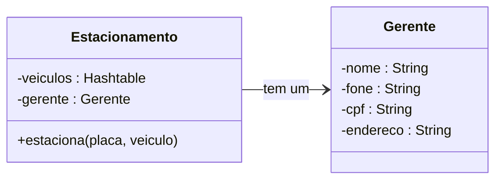
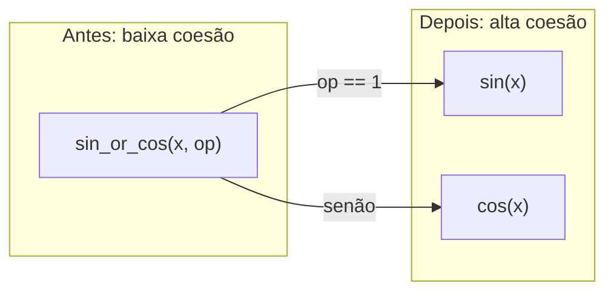
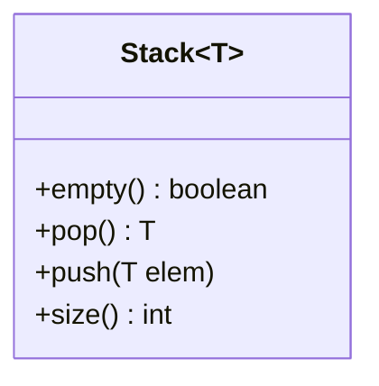
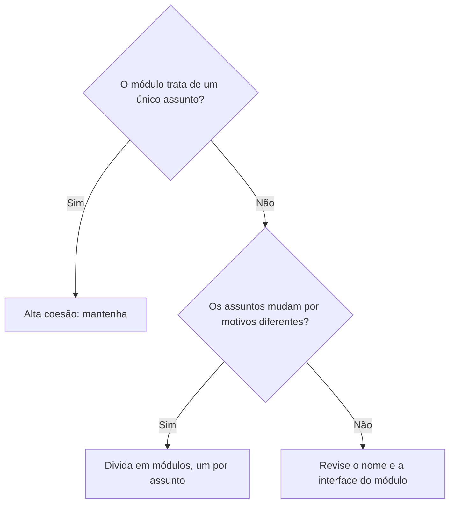

# Coesão — Notas de Aula

**Disciplina:** Engenharia de Software II
**Professor:** Mehran Misaghi
**Série:** Princípios de Projeto (Parte I) — página 3 de 4

**Nesta série:** 
---
[1. Integridade Conceitual](principios_projeto_1_integridade_conceitual.md) · 

[2. Ocultamento de Informação](principios_projeto_2_ocultamento_informacao.md) · 

**3. Coesão** · 

[4. Acoplamento](principios_projeto_4_acoplamento.md)

---

## Sumário

1. [O que é coesão](#1-o-que-é-coesão)
2. [Por que buscar alta coesão](#2-por-que-buscar-alta-coesão)
3. [Contra-exemplo 1: uma classe com dois assuntos](#3-contra-exemplo-1-uma-classe-com-dois-assuntos)
4. [Contra-exemplo 2: uma função que faz duas coisas](#4-contra-exemplo-2-uma-função-que-faz-duas-coisas)
5. [Exemplo de alta coesão: a classe Pilha](#5-exemplo-de-alta-coesão-a-classe-pilha)
6. [Como aumentar a coesão](#6-como-aumentar-a-coesão)
7. [Pontos-chave para revisão](#7-pontos-chave-para-revisão)
8. [Exercícios](#8-exercícios)
9. [Próximo Assunto](#9-próximo-assunto)

---

## 1. O que é coesão

> **Coesão** é a maneira como os componentes de um sistema, classe ou módulo (funções, métodos, dados) **estão relacionados entre si** e fazem **uma única função** de forma adequada.

Em uma classe **coesa**, todos os métodos e atributos trabalham para o mesmo fim. Em uma classe **pouco coesa**, convivem assuntos que não têm relação entre si.

O livro-texto formula a mesma ideia de três maneiras equivalentes:

| Formulação | Enunciado |
|---|---|
| **Classe coesa** | Implementa uma única funcionalidade ou serviço |
| **Responsabilidade única** | Tem um único motivo para ser modificada |
| **Separação de interesses** (*separation of concerns*) | Cuida de um único interesse do sistema |


---

## 2. Por que buscar alta coesão

A regra geral é: **normalmente precisamos de alta coesão**. Os motivos:

- **facilita a manutenção e a compreensão do código** — quem abre a classe encontra um assunto só;
- **reduz as mudanças** — a classe só precisa ser alterada quando o seu único assunto muda;
- **melhora a reutilização e a testabilidade** — um módulo que faz uma coisa só pode ser reaproveitado e testado isoladamente.

O livro-texto acrescenta um benefício de gestão: fica mais fácil atribuir **um único responsável** por cada classe.

---

## 3. Contra-exemplo 1: uma classe com dois assuntos

```java
class Estacionamento {
  ...
  private String nome_gerente;       // ❌ estes quatro atributos
  private String fone_gerente;       //    não falam de estacionamento:
  private String cpf_gerente;        //    falam de uma pessoa
  private String endereco_gerente;
  ...
}
```

A classe mistura dois assuntos: **estacionar veículos** e **cadastrar um gerente**. Se o cadastro de pessoas mudar (por exemplo, o telefone passar a ter DDI), a classe `Estacionamento` terá de ser alterada, embora nada tenha mudado no estacionamento.



### A versão com alta coesão

```java
// Classe com alta coesão: só tem dados do gerente
class Gerente {
    private String nome;
    private String fone;
    private String cpf;
    private String endereco;
}

// Classe com alta coesão: foca apenas no estacionamento
class Estacionamento {
    // ... outros atributos do estacionamento (vagas, veículos, etc.)

    // Usa a outra classe para representar o gerente associado
    private Gerente gerente;

    // ... métodos do estacionamento
}
```



Repare que os nomes dos atributos também ficaram melhores: dentro de `Gerente`, o sufixo `_gerente` deixa de ser necessário.

---

## 4. Contra-exemplo 2: uma função que faz duas coisas

Coesão não vale só para classes. A função abaixo calcula seno **ou** cosseno, dependendo de um parâmetro:

```java
float sin_or_cos(double x, int op) {
  if (op == 1)
    "calcula e retorna seno de x"
  else
    "calcula e retorna cosseno de x"
}
```

O próprio nome denuncia o problema: quando o nome de um módulo precisa de "ou" (ou de "e"), ele provavelmente faz mais de uma coisa. A solução é ter uma função para cada tarefa:

```java
float sin(double x) {
  "calcula e retorna seno de x"
}

float cos(double x) {
  "calcula e retorna cosseno de x"
}
```



---

## 5. Exemplo de alta coesão: a classe Pilha

```java
class Stack<T> {
  boolean empty() { ... }
  T pop() { ... }
  push (T) { ... }
  int size() { ... }
}
```

**Todos esses métodos manipulam os elementos da pilha.** Não há nenhum método "intruso": se a forma de guardar os elementos mudar, todos os métodos são afetados; se qualquer outra coisa do sistema mudar, nenhum é.



---

## 6. Como aumentar a coesão

| Ação | Como aplicar |
|---|---|
| **Reorganizar o código por função/responsabilidade** | Agrupe em um mesmo módulo o que muda junto e trata do mesmo assunto; mova o resto para outro módulo (como fizemos com `Gerente`) |
| **Usar interfaces diferentes para separar papéis/funções** | Se uma classe atende clientes com necessidades diferentes, ofereça uma interface para cada papel, em vez de uma única interface com tudo |
| **Revisar o nome do módulo: ele deve ser único** | Tente descrever o módulo com um nome simples, sem "e" nem "ou". Se não conseguir, ele provavelmente tem mais de uma responsabilidade |



---

## 7. Pontos-chave para revisão

- **Coesão** mede o quanto os elementos de um módulo trabalham para **uma única função**.
- **Alta coesão é o objetivo**: facilita manutenção e compreensão, reduz mudanças, melhora reúso e testes.
- Vale para **funções, classes e módulos maiores**.
- Sinais de **baixa coesão**: atributos de outro assunto (`cpf_gerente` em `Estacionamento`), parâmetros que escolhem o que a função faz (`op`), nomes com "e"/"ou", classes chamadas `Util` ou `Helper`.
- Para aumentar a coesão: **reorganizar por responsabilidade**, **separar papéis com interfaces** e **revisar o nome** do módulo.
- Na próxima página, a coesão ganha um par inseparável: o [acoplamento](principios_projeto_4_acoplamento.md).

---

## 8. Exercícios

**1.** Classifique cada módulo como de **alta** ou **baixa** coesão e justifique:

- (a) classe `Util` com os métodos `formatarData`, `enviarEmail` e `calcularImposto`;
- (b) classe `Fila<T>` com os métodos `enfileirar`, `desenfileirar`, `tamanho` e `vazia`;
- (c) função `salvarOuRemover(objeto, flag)`;
- (d) classe `Aluno` com os atributos `nome`, `matricula`, `rua`, `cidade`, `cep` e os métodos `calcularMedia` e `validarCep`.

**2.** A classe abaixo pertence a uma loja virtual.

```java
class Pedido {
  private List<Item> itens;
  private double total;

  public void adicionarItem(Item item) { ... }
  public double calcularTotal() { ... }
  public void enviarEmailDeConfirmacao() { ... }
  public void gerarPdfDaNotaFiscal() { ... }
  public void conectarAoBancoDeDados() { ... }
}
```

- (a) Quantas responsabilidades diferentes você identifica? Quais?
- (b) Proponha uma nova divisão em classes e desenhe o diagrama de classes em Mermaid.
- (c) Para cada classe da sua solução, cite um motivo que levaria apenas ela a ser modificada.

**3.** *(Exercício da aula)* Sejam duas classes A e B que:

- estão implementadas em diretórios diferentes;
- a classe A possui uma referência no seu código para B.

Então, sempre que um programador precisa, como parte de uma tarefa de manutenção, modificar classes A e B que atendem a tais critérios, ele conclui a tarefa movendo B para o mesmo diretório de A.

- (a) Agindo dessa maneira, o programador estará melhorando qual propriedade de projeto (quando medida entre diretórios)?
- (b) E qual propriedade é afetada de modo negativo?

**4.** A função abaixo é chamada em vários pontos de um sistema:

```java
void processa(Dados d, int modo) {
  if (modo == 1) { /* valida os dados */ }
  else if (modo == 2) { /* grava os dados no banco */ }
  else if (modo == 3) { /* imprime os dados */ }
}
```

- (a) Por que essa função tem baixa coesão?
- (b) Reescreva apenas as **assinaturas** das funções que deveriam substituí-la.
- (c) O que melhora para quem **lê** uma chamada como `processa(d, 2)` depois da sua mudança?

**5.** Explique por que é mais fácil escrever testes de unidade para a classe `Stack<T>` da Seção 5 do que para a classe `Util` do exercício 1(a).

**6.** Para cada nome de classe, diga se ele sugere um problema de coesão e por quê: `GerenciadorGeral`, `ClienteERelatorio`, `CalculadoraDeFrete`, `Helper`, `RepositorioDeAlunos`.

**7.** *(Para discussão)* É possível exagerar na busca por coesão? Descreva o que aconteceria com um sistema em que cada classe tivesse um único método, e relacione sua resposta com o tema da próxima página.

---

## 9. Próximo Assunto
- [4. Acoplamento](principios_projeto_4_acoplamento.md)
