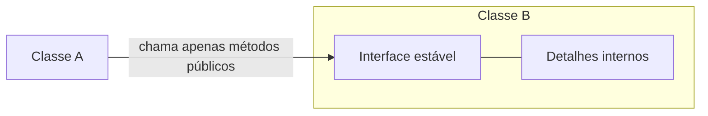
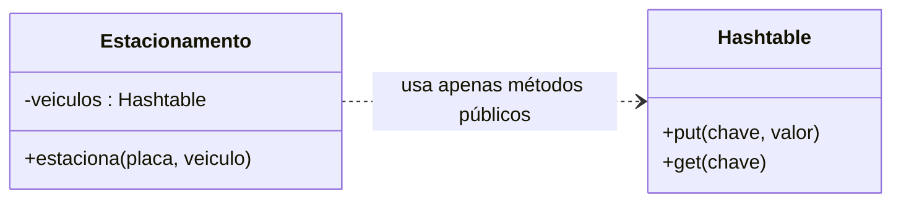
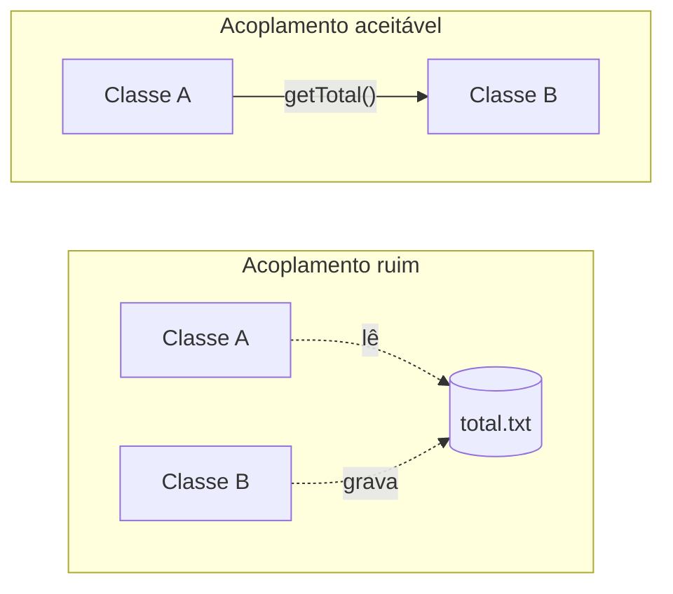
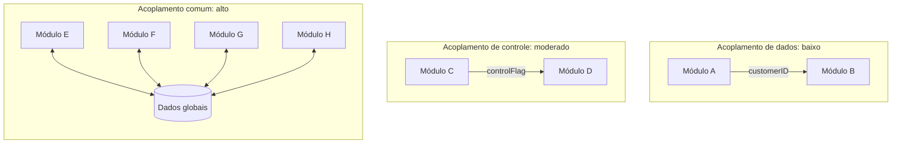

# Acoplamento — Notas de Aula

> Este material foi elaborado com auxílio de IA e revisado. Qualquer dúvida converse com professor.

> **Nesta série:** [1. Integridade Conceitual](principios_projeto_1_integridade_conceitual.md) · [2. Ocultamento de Informação](principios_projeto_2_ocultamento_informacao.md) · [3. Coesão](principios_projeto_3_coesao.md) · **4. Acoplamento**

---

## Sumário

1. [O que é acoplamento](#1-o-que-é-acoplamento)
2. [Acoplamento aceitável](#2-acoplamento-aceitável)
3. [Acoplamento ruim](#3-acoplamento-ruim)
4. [Do acoplamento baixo ao alto](#4-do-acoplamento-baixo-ao-alto)
5. [Maximize a coesão e minimize o acoplamento](#5-maximize-a-coesão-e-minimize-o-acoplamento)
6. [Pontos-chave para revisão](#6-pontos-chave-para-revisão)
7. [Exercícios](#7-exercícios)

---

## 1. O que é acoplamento

**Nenhuma classe é uma ilha.** Em qualquer sistema real, classes dependem umas das outras: chamam métodos de outras classes, estendem outras classes etc. **Acoplamento** é a força dessa conexão entre dois módulos.

Como alguma dependência sempre vai existir, a questão principal não é *se* há acoplamento, e sim a **qualidade** desse acoplamento. Há dois tipos:

| Tipo | Também chamado de | Efeito |
|---|---|---|
| ✅ **Acoplamento aceitável ("bom")** | Baixo acoplamento | Mudanças em um módulo raramente atingem o outro |
| ❌ **Acoplamento ruim** | Alto acoplamento | Mudanças em um módulo se propagam facilmente para o outro |

---

## 2. Acoplamento aceitável

Uma classe A usa uma classe B, e o acoplamento entre elas é **aceitável** quando:

1. **B oferece um serviço útil para A** (a dependência tem razão de existir);
2. **B possui uma interface estável**;
3. **A somente chama métodos da interface de B**.



### Exemplo: Estacionamento e Hashtable

```java
import java.util.Hashtable;                               // dependência explícita

public class Estacionamento {

  private Hashtable<String,String> veiculos;              // Estacionamento usa Hashtable

  public Estacionamento() {
    veiculos = new Hashtable<String, String>();
  }

  public void estaciona(String placa, String veiculo) {
    veiculos.put(placa, veiculo);                          // só métodos públicos
  }
}
```

A classe `Estacionamento` **depende** (está acoplada) à classe `Hashtable`, **mas esse acoplamento é aceitável**: a `Hashtable` presta um serviço útil, faz parte da biblioteca padrão de Java (interface estável) e é usada apenas por meio de seus métodos públicos.



---

## 3. Acoplamento ruim

O acoplamento é **ruim** quando mudanças em B podem facilmente afetar A. Segundo o livro-texto, isso acontece tipicamente quando a dependência **não passa por uma interface estável**:

- A acessa diretamente um **arquivo ou banco de dados** de B;
- A e B compartilham uma **variável ou estrutura de dados global**;
- a interface de B é **instável** (métodos públicos mudam com frequência).

Um exemplo do primeiro caso (tratamento de exceções omitido):

```java
// ❌ Acoplamento ruim: A e B "conversam" por um arquivo
class B {
  void fecharCaixa() {
    int total = ...;   // calcula o total do dia
    Files.writeString(Path.of("total.txt"), String.valueOf(total));
  }
}

class A {
  void imprimirResumo() {
    int total = Integer.parseInt(Files.readString(Path.of("total.txt")));
    System.out.println("Total do dia: " + total);
  }
}
```

Não existe nenhuma variável do tipo `B` dentro de `A`, e mesmo assim as duas classes estão fortemente acopladas: se quem mantém B mudar o nome ou o formato do arquivo, A para de funcionar, e ninguém é avisado.

```java
// ✅ Acoplamento aceitável: a dependência passa pela interface de B
class B {
  private int total;
  public int getTotal() { return total; }
}

class A {
  void imprimirResumo(B b) {
    System.out.println("Total do dia: " + b.getTotal());
  }
}
```

Agora a dependência é **explícita** e mediada por um método público. Quem altera `getTotal()` sabe que está mexendo em uma interface.



---

## 4. Do acoplamento baixo ao alto

Entre o acoplamento mais desejável e o menos desejável há uma escala. Três pontos dela:



| Tipo | Nível | O que acontece |
|---|---|---|
| ✅ **Acoplamento de dados** (*data coupling*) | Baixo | Os módulos interagem apenas por **dados passados como parâmetros**. É a forma mais desejável: os módulos ficam independentes e fáceis de manter |
| **Acoplamento de controle** (*control coupling*) | Moderado | Um módulo **dirige a execução** do outro passando uma *flag* ou comando. Quem chama precisa conhecer o funcionamento interno de quem é chamado |
| ❌ **Acoplamento comum** (*common coupling*) | Alto | Vários módulos **compartilham e dependem de dados globais**. Uma mudança nesses dados pode afetar todos eles; o sistema fica difícil de entender e de manter |

> **Ligação com a página anterior:** a função `sin_or_cos(x, op)`, que estudamos em [Coesão](principios_projeto_3_coesao.md), é também um caso de acoplamento de controle: o parâmetro `op` existe só para dizer à função o que fazer. Baixa coesão e acoplamento ruim costumam aparecer juntos.

---

## 5. Maximize a coesão e minimize o acoplamento

A recomendação mais comum em projeto de software é:

> **Maximize a coesão, minimize o acoplamento.**

| | **Baixo acoplamento** | **Alto acoplamento** |
|---|---|---|
| **Alta coesão** | ✅ O objetivo: módulos focados e independentes | Módulos focados, mas que quebram uns aos outros |
| **Baixa coesão** | Módulos independentes, mas confusos por dentro | ❌ O pior cenário: tudo misturado e tudo dependente |

**Mas cuidado:** minimize (ou elimine) principalmente o **acoplamento ruim**. Tentar eliminar *todo* acoplamento não faz sentido, pois classes dependem naturalmente de serviços úteis, como estruturas de dados e bibliotecas de entrada e saída.

> **Indo além (livro-texto):** além do acoplamento **estrutural**, em que A tem uma referência explícita a B no código, existe o acoplamento **evolutivo** (ou lógico), em que mudanças em B tendem a exigir mudanças em A mesmo sem referência explícita, como no exemplo do arquivo `total.txt`.

---

## 6. Pontos-chave para revisão

- **Acoplamento** é a força da conexão entre módulos; sempre existe algum.
- O que importa é a **qualidade**: aceitável ("bom", baixo) ou ruim (alto).
- **Aceitável:** B presta um serviço útil, tem interface estável, e A só usa essa interface.
- **Ruim:** dependência por arquivo, banco de dados, variável global ou interface instável.
- Escala estudada: **dados** (baixo) → **controle** (moderado) → **comum** (alto).
- **Maximize a coesão, minimize o acoplamento** — principalmente o acoplamento ruim.
- As propriedades se reforçam: [ocultar informação](principios_projeto_2_ocultamento_informacao.md) produz interfaces estáveis, e interface estável é justamente a condição do acoplamento aceitável.

---

## 7. Exercícios

**1.** *(Exercício da aula)* Considere o programa:

```javascript
var g = 1; // global
f();
print g;
```

- (a) Você consegue dizer qual valor o programa vai imprimir, sem conhecer o código de `f`?
- (b) Usando esse programa como exemplo, explique por que variáveis globais dão origem a designs ruins.
- (c) Sistemas com muitas variáveis globais não atendem a quais propriedades de projeto?

**2.** *(Exercício da aula)* Genericamente falando, qual dos seguintes projetos é melhor? Justifique. (Nodos = classes; arestas = dependências.)


*Adaptado de: Bertrand Meyer, Object-Oriented Software Construction, 1997 (pág. 47).*

**3.** Classifique cada situação como acoplamento **de dados**, **de controle** ou **comum**, e justifique:

- (a) `calcularFrete(cep, peso)` recebe dois valores e devolve o preço;
- (b) `gerarRelatorio(dados, tipo)`, em que `tipo` decide qual trecho da função será executado;
- (c) cinco módulos leem e alteram um objeto `configuracaoGlobal`;
- (d) `ordenar(lista, crescente)`, em que `crescente` é um booleano.

**4.** Para cada dependência, diga se o acoplamento é **aceitável** ou **ruim**, usando os três critérios da Seção 2:

- (a) uma classe usa `ArrayList`, da biblioteca padrão de Java;
- (b) uma classe lê diretamente um atributo público de uma classe mantida por outra equipe;
- (c) uma classe chama métodos de uma biblioteca interna cujas assinaturas mudam a cada *sprint*;
- (d) um microsserviço consulta diretamente as tabelas do banco de dados de outro microsserviço.

**5.** Reescreva o código abaixo para que o acoplamento entre `Relatorio` e `Vendas` passe a ser aceitável. Depois, explique o que mudou em relação a cada um dos três critérios.

```java
class Vendas {
  public static double totalDoMes;   // atualizado em vários pontos do sistema
}

class Relatorio {
  void imprimir() {
    System.out.println("Total: " + Vendas.totalDoMes);
  }
}
```

**6.** No projeto (B) do exercício 2, suponha que a interface de uma das classes mude. Quantas classes podem ser afetadas? E no projeto (A), se a classe alterada for (i) a central ou (ii) uma das externas? O que isso diz sobre o custo de manutenção de cada projeto?

**7.** *(Para discussão)* "Um sistema com acoplamento zero seria o ideal." Você concorda? Use a frase "nenhuma classe é uma ilha" na sua resposta.

**8.** *(Integrador — as quatro propriedades)* Um sistema de biblioteca tem uma classe `Sistema` com 2.000 linhas, que cadastra livros, cadastra usuários, calcula multas e envia e-mails. Os dados ficam em listas públicas e estáticas, acessadas por todas as telas. Metade dos métodos se chama `cadastra_livro`, `calcula_multa`; a outra metade, `enviarEmail`, `removerUsuario`. Identifique um problema para **cada uma** das quatro propriedades estudadas nesta série e proponha uma correção para cada um.

---
